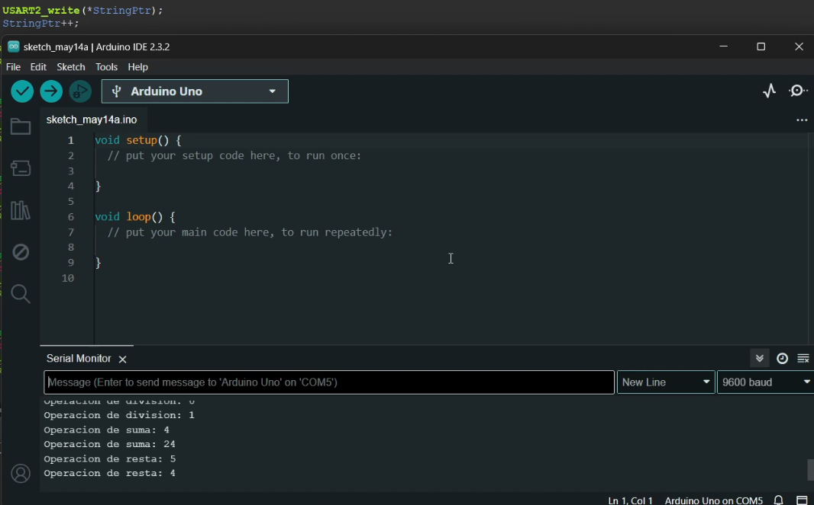

Proyecto STM32 Display y Teclado Matricial

CAMBIAR A RAMA MASTER

Descripción

Este proyecto implementa un sistema de visualización y entrada utilizando un microcontrolador STM32. Se utiliza un teclado matricial para la entrada de datos y displays de 7 segmentos para mostrar la información. El código configura los puertos GPIO del microcontrolador para manejar tanto los displays como el teclado.

Archivos

main.c: Contiene el código principal del proyecto, incluyendo la configuración de los puertos GPIO y la lógica para leer el teclado y actualizar los displays.
stm32lm053xx.h: Archivo de cabecera que define las direcciones base y estructuras para los registros del microcontrolador STM32, así como macros útiles para la configuración del hardware.
Configuración

Requisitos

STM32 Microcontroller (ej. STM32L053xx)
Teclado matricial
Displays de 7 segmentos
Entorno de desarrollo compatible (ej. STM32CubeIDE)
Configuración del Hardware
GPIOC: Configurado para controlar los displays de 7 segmentos.

Pines configurados como salida: PC4, PC5, PC6, PC7, PC8, PC9.
GPIOB: Configurado para manejar tanto los segmentos de los displays como las columnas del teclado matricial.

Pines PB0 a PB7: Configurados como salida para los segmentos del display.

Pines PB8 a PB11: Configurados como entrada para las filas del teclado matricial, con resistencias pull-up.

Pines PB12 a PB15: Configurados como salida para las columnas del teclado matricial.

Configuración del Software

Habilitar los relojes para los puertos GPIOA, GPIOB y GPIOC.

Configurar los pines de GPIOC y GPIOB según lo descrito en la sección de configuración del hardware.

Implementar la lógica para escanear el teclado matricial y actualizar los displays con los valores correspondientes.

Uso

Inicialización

Al iniciar el sistema, se configuran los puertos GPIO y se prepara el sistema para leer entradas del teclado y actualizar los displays.

Funcionamiento

El sistema lee continuamente las entradas del teclado matricial y actualiza los displays de 7 segmentos con los valores correspondientes. La lógica principal incluye la lectura de filas y columnas del teclado para detectar qué tecla se ha presionado y luego convertir esa entrada en un valor que se muestra en los displays.

Interacción con la Consola
Durante el funcionamiento, se pueden ver mensajes en la consola que indican las operaciones realizadas, como la configuración de los puertos GPIO y la actualización de los displays.

Ejemplo de Salida en la Consola:

